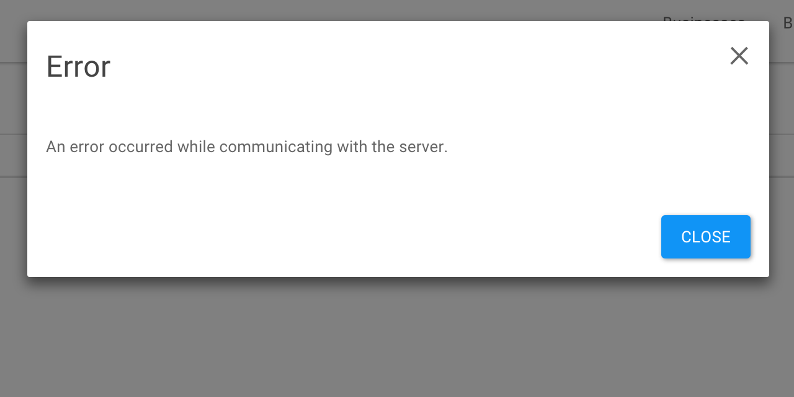

Currently, my preferred technology stack on the front-end is using [React](http://facebook.github.io/react/) for the views and [Backbone](http://backbonejs.org/) to give the app its structure (router, event bus, models, collections etc.).

Using React gives you all the goodness of components that manage their own state and the [amazing performance](https://www.codementor.io/reactjs/tutorial/reactjs-vs-angular-js-performance-comparison-knockout) of the virtual DOM.

However, it can be tricky to keep components isolated using React in the case where components need to be reused. Let's take the example of modals that should pop up on the screen to grab the user's attention. These are typically used for error messages, info messages or confirmation boxes. Here is an example of a modal being used to display an error message:

{: width="100%" }

Typically the modals are very simple, as the one in the image. It will either give the user some information with a 'Close' button or it will ask the user to confirm whether they intend to do something (with an 'OK' and a 'Cancel') button. Each modal popup will also contain a message in the body and a title.

Each component in React requires a root where it is mounted. This is the structure of my HTML document:



The `

` tag is used as the root for the modal boxes to render inside. All modals are rendered inside of a so-called ModalsComponent that acts as the parent for all modals:



An important thing to notice about this module is the `registerModal` method. This method will be used to add modals to the ModalsComponent in a way that allows us to add new modals without modifying any of the code on the ModalsComponent module itself. It is worth mentioning at this point that I use [Browserify](http://browserify.org/) in order to package my apps into a single file. I highly recommend you check it out. I also use [React Bootstrap](https://react-bootstrap.github.io/) for the CSS goodness.

Now for the actual modals that are visible to the user. The code for the error modal is as follows:



Notice how the modal error box is registered with the ModalsComponent by passing it to the `registerModal` method mentioned above.

The basic working of the error modal is that it listens on the event-bus for the "showError" event and once that event is fired the `onShowError` method of the component is called with the payload of the event being passed in as an argument. This payload consists of the message to be displayed in the error box and an (optional) `onAfterClose` handler that is to be called after the error box is closed. I will dive into the need for an event-bus in a later post. For now you can have a look at the [Publish-Subscribe Pattern](https://en.wikipedia.org/wiki/Publish%E2%80%93subscribe_pattern) and the [Events](http://backbonejs.org/#Events) object of Backbone.

The opposite is true for the `onHideError` event. If this event is triggered for whatever reason, the error modal is hidden.

The information modal is an exact copy of the error component apart from the title.

Confirmation is slightly different since the user has two options when the modal pops up, namely to click 'OK' or to click 'Cancel'.



The default behaviour for the 'Cancel' button is assumed and only the handler that will be called when the 'OK' button is clicked can be passed in.

Similar to the error modal, the confirmation modal listens for the `onShowConfirm` event.

Here is an example of triggering a modal error with a custom callback function. In this example, the user is notified that they are not logged in and they are then redirected to the login page after they close the error modal.



The effect of this pattern is that it decouples the management of the display of modal popups from the state of the views themselves. The implementation of the modal's markup is abstracted away into a couple of generic types of popups that can be called from the view by triggering the events that the modals are listening for.
