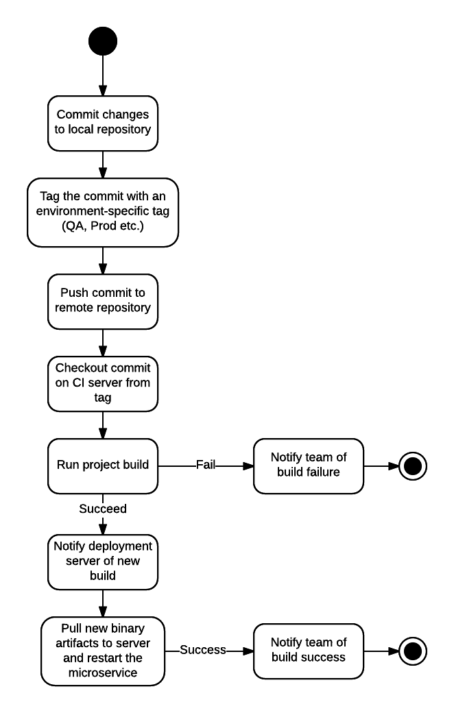
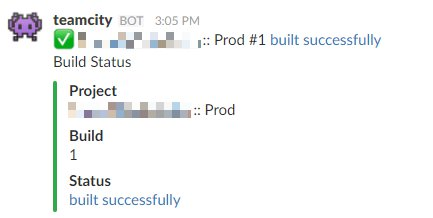
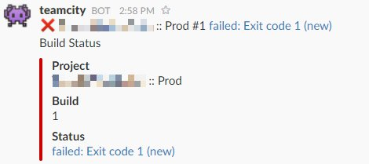

A large portion of the software engineering world has moved away from large monolithic software designs. Instead of having tightly-coupled systems, the modern trend in software is to create multiple smaller, independent microservices. This allows different microservices to be responsible for different functionality in the greater system. The only thing that a consumer of a microservice is concerned with is the interface that the microservice exposes. Typically these microservices communicate with each other via HTTP requests.

Since microservices are typically small, decoupled units, they are perfect candidates for continuous deployment pipelines. With a continuous integration and deployment pipeline, code gets pushed straight to QA or Production when it compiles and the unit tests pass. There are several Continuous Integration tools for Java. The two most-used tools are [TeamCity](https://www.jetbrains.com/teamcity/) and [Jenkins](https://jenkins-ci.org/). These tools typically check out the code from the repository when it is updated, executes the build script (Maven, Gradle, Ant etc.) and if all the tests pass and the code compiles, the build passes. In general it is beneficial to have a notification set up that notifies the relevant parties if a build fails. The earlier the team can know there is a problem with a commit, the faster it can be fixed.

While there are many fully-featured tools for Continuous Integration, the continuous delivery part of the pipeline lacks a standard set of tools that provide the functionality we are looking for out of the box. Below you will see a flow diagram of what the pipeline should look like at a conceptual level:

{: style="max-width: 450px; width: 100%;" }

In our organization I have set up notifications via a dedicated Slack channel. The notification messages typically look like this when a build passes:

{: style="max-width: 100%;" }

When the build fails, you get a horrible-looking red cross like this:

{: style="max-width: 100%;" }

Using these notifications, the whole team is on the pulse and everyone takes notice when builds fail.

On the server itself, I run a deployment HTTP server written in Python with [Flask](http://flask.pocoo.org/). This server exposes REST endpoints that are password-protected which can be called in order to initiate the deployment of the respective microservices. Each microservice will have its own endpoint and the build type (QA or Production) is passed as an argument to the HTTP server. From TeamCity, this service is called using `curl` from a shell script that is configured to run when the build passes.

TeamCity exposes the binary artifacts created during the build step via a web service. From the QA or Production servers, these artifacts can be downloaded using `wget` for the specified build configuration. After the artifact(s) are downloaded, the microservice is restarted on the server.
